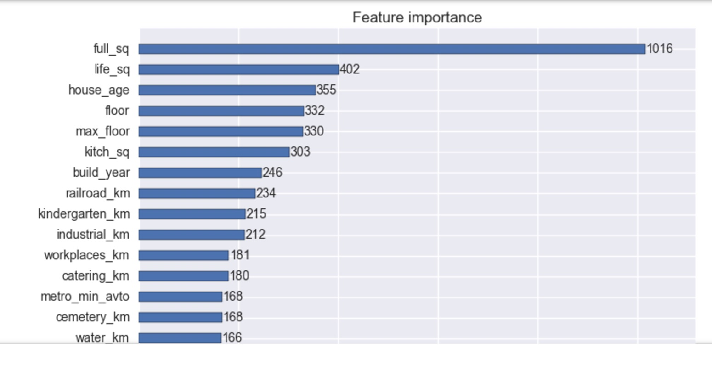
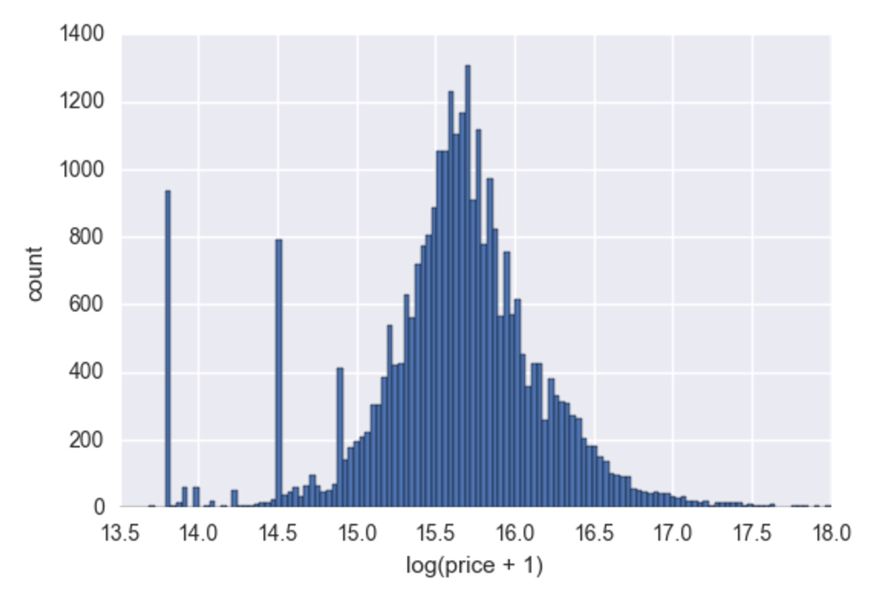

# XGBoost-theory-n-application

## Introduction: Theory

An introductory lecture to XGBoost is scheduled in [Big Data Utah meetup](https://www.meetup.com/BigDataUtah/events/238610160/). The lecture file ([talk.pdf](https://github.com/Shiutang-Li/XGBoost-theory-n-application/blob/master/talk.pdf)) contains three main parts:

1. Analysis of XGBoost algorithm, with math explained in detail.

2. Introduction to major XGBoost parameters and parameter tuning.

3. A demo file showing how to apply XGBoost to kaggle Allstate Claims Severity dataset.  
Demo jupyter notebook: [Demo.ipynb](https://github.com/Shiutang-Li/XGBoost-theory-n-application/blob/master/Demo.ipynb)

| | | 
|:---:|:---:|

## Introduction: Application

Given the house price data in Moscow from 2011-2015, the goal of this project is to predict the house prices in Moscow from year 2015-2016. This is a competition currently hosted by kaggle: https://www.kaggle.com/c/sberbank-russian-housing-market

I used XGBoost in this competition and ranked 10th / 3246 teams. I'll talk about the details in a local data science meetup. The leader board can be found in
https://www.kaggle.com/c/sberbank-russian-housing-market/leaderboard

| | | 
|:---:|:---:|
