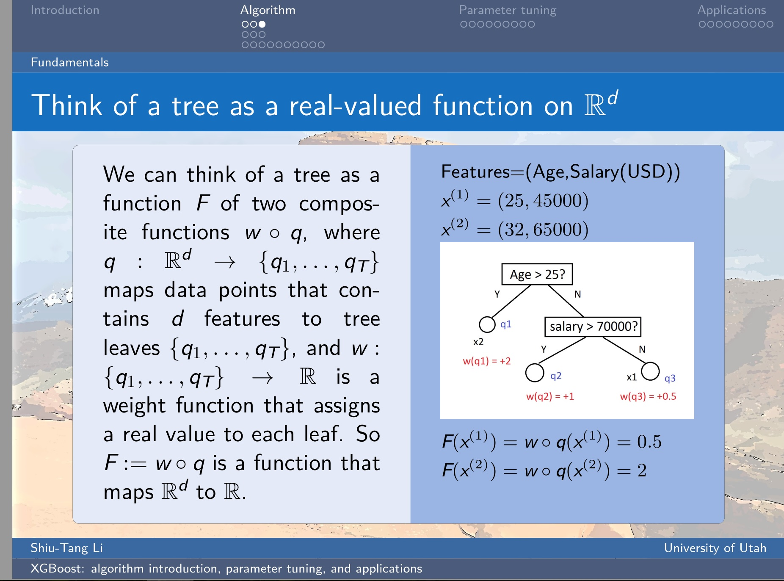
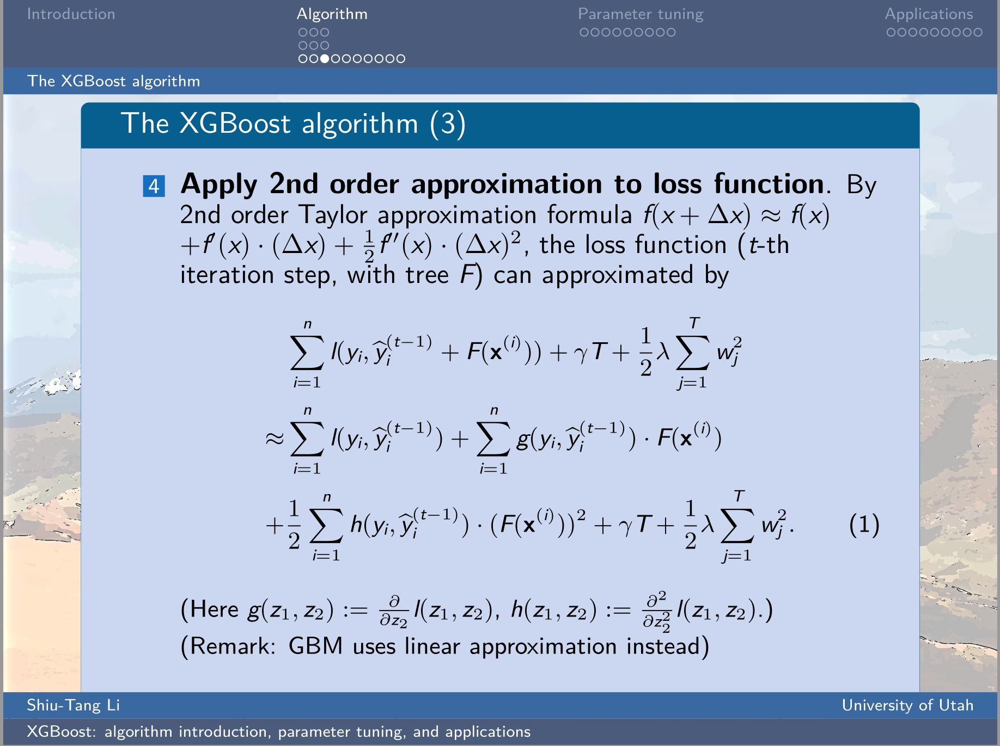

# XGBoost-theory-n-application

## Introduction: Theory

An introductory lecture to XGBoost is scheduled in [Big Data Utah meetup](https://www.meetup.com/BigDataUtah/events/238610160/). The lecture file ([talk.pdf](https://github.com/Shiutang-Li/Intro-to-XGBoost/blob/master/talk.pdf)) contains three main parts:

1. Analysis of XGBoost algorithm, with math explained in detail.

2. Introduction to major XGBoost parameters and parameter tuning.

3. A quick example showing how to apply XGBoost to kaggle Allstate Claims Severity dataset for beginners.  
Demo jupyter notebook: [Demo.ipynb](https://github.com/Shiutang-Li/Intro-to-XGBoost/blob/master/Demo.ipynb)

| | | 
|:---:|:---:|

## Introduction: Application

Given the house price data in Moscow from 2011-2015, the goal of this project is to predict the house prices in Moscow from year 2015-2016. This is a competition currently hosted by kaggle: https://www.kaggle.com/c/sberbank-russian-housing-market

This notebook is not copied from any other kernels in kaggles, and it scores top 7% in public leader board (Team name: STL) (https://www.kaggle.com/c/sberbank-russian-housing-market/leaderboard/public?asOf=2017-5-27).

| | | 
|:---:|:---:|

## View the report  / Run the codes

[Single XGboost.ipynb](https://github.com/Shiutang-Li/Moscow-house-price/blob/master/Single%20XGboost.ipynb)

## Dependencies 

* Python 3.5   
* xgboost 0.6
* pandas, numpy, seaborn, pylab
